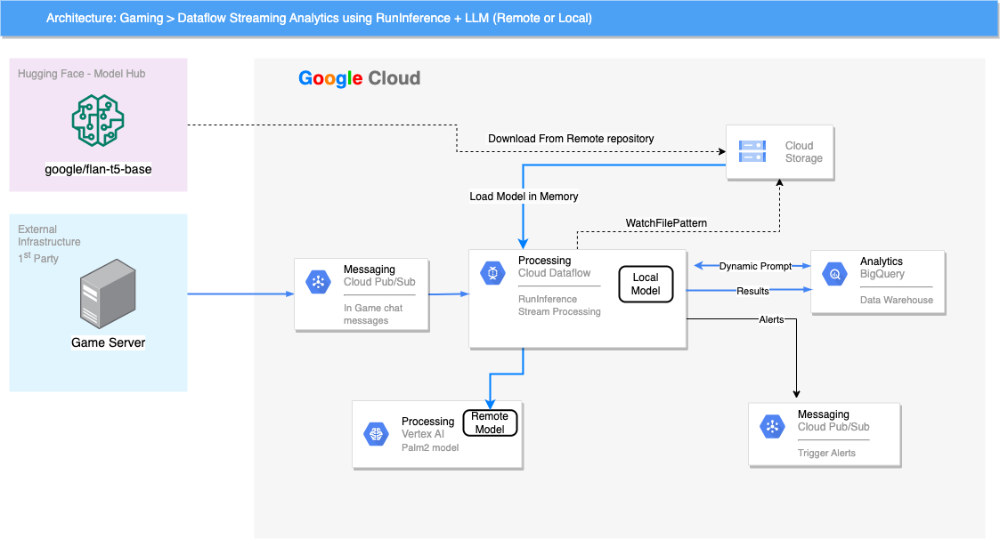

# GenAI Streaming analytics with Dataflow & Runinference 

## Disclaimer
This repository and its contents are not an officially supported Google product.


## License
All solutions within this repository are provided under the [Apache 2.0](https://www.apache.org/licenses/LICENSE-2.0) license. 
Please see the [LICENSE](LICENSE) file for more detailed terms and conditions.

## Introduction

The purpose of this project is to showcase how easy we can build a streaming data pipeline using Dataflow and RunInference 
in order to get new business insight from unstructured data such as text (taken from game chat messages) and using an LLM model 

This pipeline offers 2 main flexibilities that can be changed without re-start of the pipeline
- the LLM model can be dynamically updated after fine-tuning : just by adding a new .pt file inside the model bucket
- the prompt can be dynamically updated inside Bigquery Table : to create new business insights

## Versions
- python 3.9.12
- apache-beam[gcp] 2.52.0


## Architecture


## Built with

- [DOTA 2 game chat dataset](https://www.kaggle.com/datasets/romovpa/gosuai-dota-2-game-chats) In Game chat messages , real data taken from Kaggle .
- [Google/Flan-T5](https://huggingface.co/google/flan-t5-base) T5 a Text to Text encoder-decoder model that converts all NLP problems into a text-to-text format .
- [GCP Dataflow](https://cloud.google.com/dataflow?hl=en) - GCP serverless unified batch and streaming data processing engine .
  - [Beam RunInference](https://beam.apache.org/documentation/sdks/python-machine-learning/) core transformer - part used in the Dataflow pipeline. 
- [BigQuery](https://cloud.google.com/bigquery?hl=en) GCP serverless enterprise Data Warehouse- storing raw data , replaying it through Pub/Sub and storing detection results .
- [GCP Pub/Sub](https://cloud.google.com/pubsub?hl=en)  GCP message bus to stream game chats.
- [GCS](https://cloud.google.com/storage?hl=en) GCP Object storage used to store the LLM model files .


## How to run?
Before running on the Google Cloud Dataflow platform, make sure you are authenticated:
```bash
gcloud auth application-default login
```
Read more about the command in the [official docs](https://cloud.google.com/sdk/gcloud/reference/auth/application-default/login).


## Data preparation 
1. Download Basic Model from HuggingFace and store it in the model folder [Google/Flan-T5](https://huggingface.co/google/flan-t5-base)
   you can run sample code like in loadstoremodel function [infra.py](runinferenceutil/infra.py) 
2. Download [Dota2 game chats](https://www.kaggle.com/datasets/romovpa/gosuai-dota-2-game-chats) from Kaggle then 
   Create Dataset/Table in BQ to load it into
3. Create Events PubSub Topic : The Dataflow pipeline [main](main.py) will read from and [load_data_frombq_topubsub.py](runinferenceutil/load_data_frombq_pubsub.py) will push to 
4. Create Alerts PubSub Topic : Topic to send alerts to
5. Create prompts Table in Bigquery, for the demo test write the following prompts into it 
    ``` sql
    CREATE TABLE `<project_id>.<dataset_id>.prompts`
    (
      prompt STRING NOT NULL
    );
    INSERT `<project_id>.<dataset_id>.prompts` (prompt)
    VALUES('Answer by [Yes|No] : does the following text, extracted from gaming chat room, can indicate a connection or delay issue : ')
    ```


### Run the pipeline with Dataflow:
```bash
python -m main.py 
  --setup_file=./setup.py 
  --experiments=enable_data_sampling
  --job_name=dataflow-runinference
  ---temp_location=<GCS temp bucket>
  --region=<region_id>
  --network=<network_id>
  --runner=DataflowRunner
  --inputTopic=projects/<project_id>/topics/<toptic_name>
  --alertTopic=projects/<project_id>/topics/<alert-topic_name>
  --state_dict_path=gs://<some_bucket>/model/model-flan-t5-base.pt
  --model_file_pattern=gs://<some_bucket>/model/*.pt : 
```

The basic state_dict_path can be downloaded from HuggingFace 

### Run the demo with 2 different prompts and 2 different event set read from Bigquery
First Run
```bash
python -m runinferenceutil/load_data_frombq_pubsub.py
  --project_id=<project_id>
  --topic_id=projects/<project_id>/topics/<toptic_name>
```
Now Before Second Run 
1. Update the prompts table inside Bigquery with new prompt like this , 
``` sql
TRUNCATE TABLE `<project_id>.<dataset_id>.prompts` ;
INSERT `<project_id>.<dataset_id>.prompts` (prompt)
VALUES('perform sentiment analysis on the following text, return Yes if the sentiment is positive No otherwise : ')
```
- Before proceed to next step, make sure the prompt side input is updated inside the Job 
(you can check the sample data)

2. Comment the first query (game-id=507332) inside code [load_data_frombq_pubsub.py](runinferenceutil/load_data_frombq_pubsub.py) 
and uncomment the second query to send data of another game (game-id=617328) then run again 


## Runinference Logic

```
    file_pattern = known_args.model_file_pattern
    side_input_pcoll = (
            pipeline
            | "FilePatternUpdates" >> WatchFilePattern(file_pattern=file_pattern, interval=60)
    )
    predictions, other = (
            chat_messages_pcoll
            | "RunInference" >> RunInference(
                        model_handler.with_preprocess_fn(infra.to_tensors)
                        .with_postprocess_fn(infra.from_tensors),
                        model_metadata_pcoll=side_input_pcoll,
                        inference_args={"max_new_tokens": MAX_RESPONSE_TOKENS},
        ).with_exception_handling()
    )
```


## Usage
Use examples liberally, and show the expected output if you can. It's helpful to have inline the smallest example of usage that you can demonstrate, while providing links to more sophisticated examples if they are too long to reasonably include in the README.


